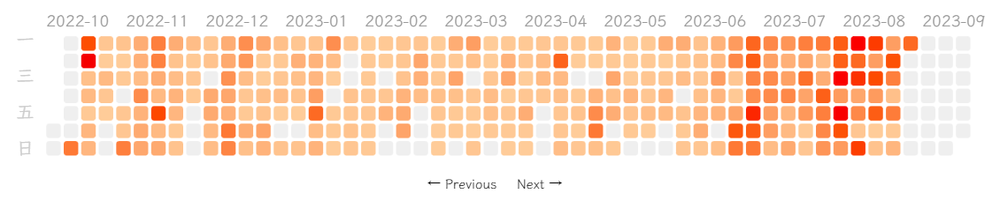

# Trilium-Heatmap
Display a note modification heatmap in your Trilium note, just like the Github contributions heatmap!

Powered by [d3.js](https://d3js.org/).
(It may not work properly before Trilium v0.60, If it doesn't work, please upgrade your Trilium version.)

## Features
- Display a heatmap of note edits in Trilium.
- View the number of edits per day for each note.
- Click to navigate to the corresponding date.

## Installation
1. Download the zip file from the latest Releases.
2. In the Trilium note, right-click to import, select the zip file, uncheck "Safe import," and then click the "Import" button.
3. Enjoy it!
